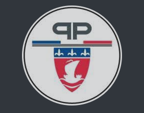
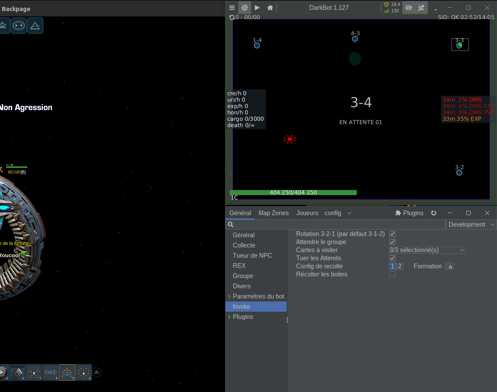
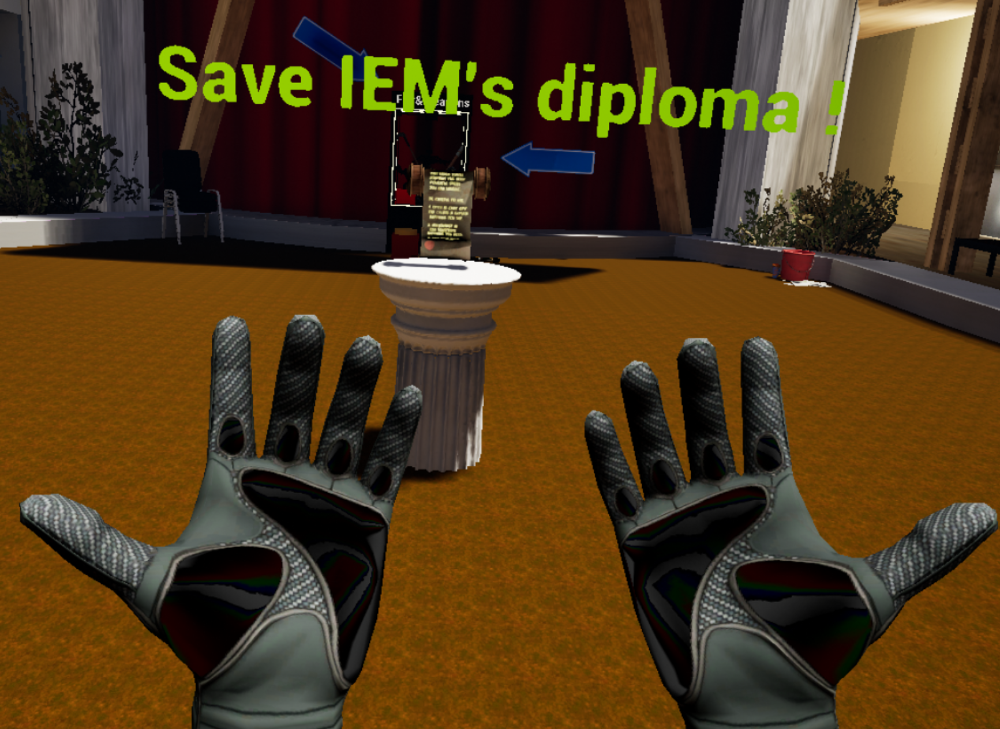
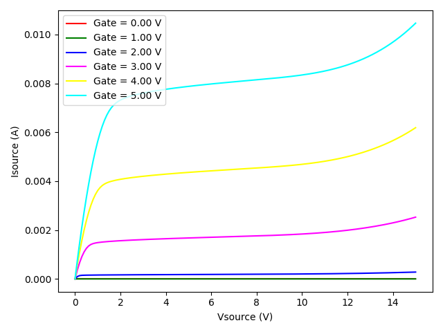
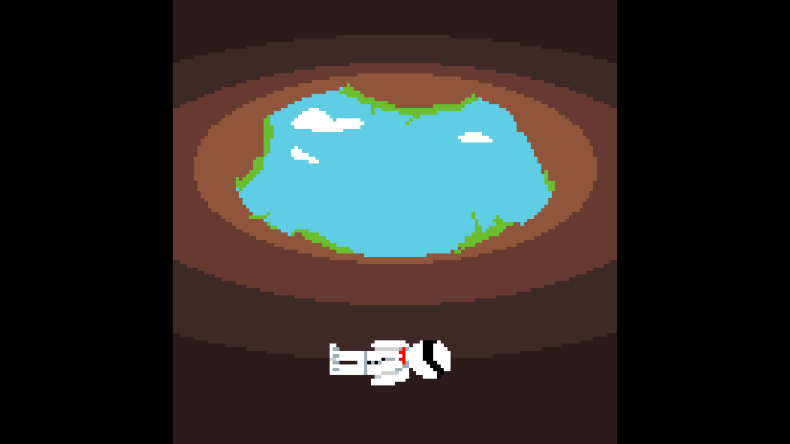
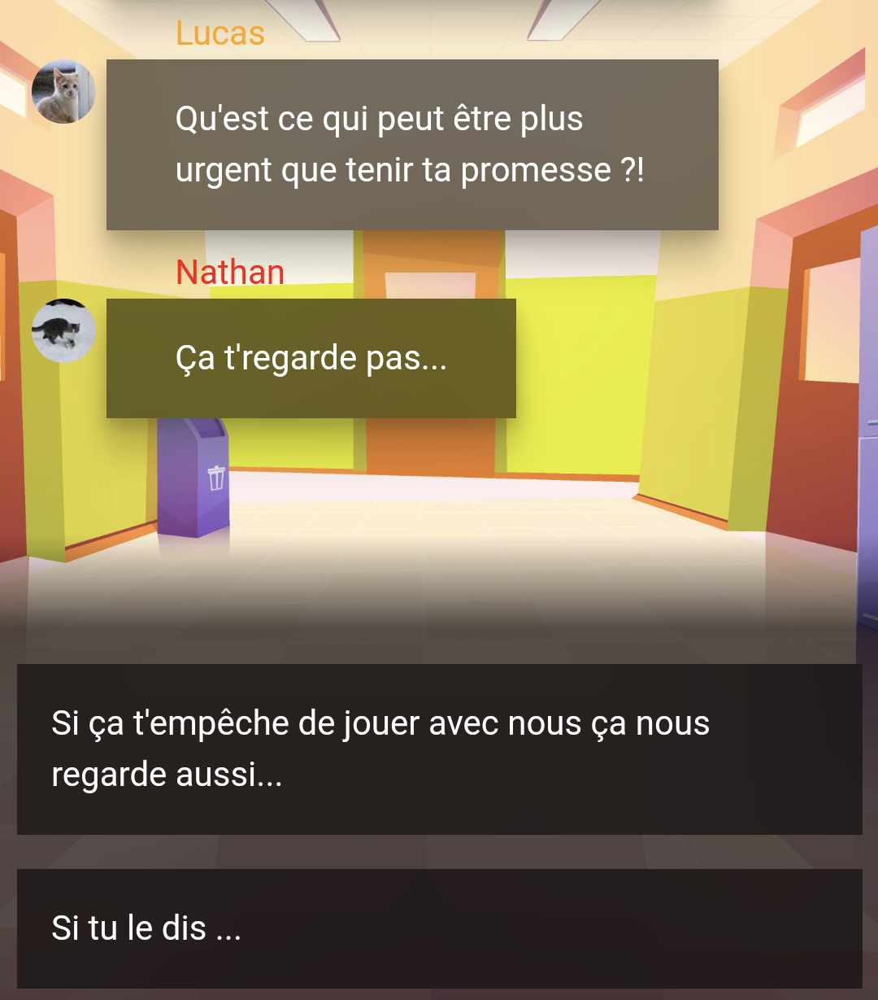
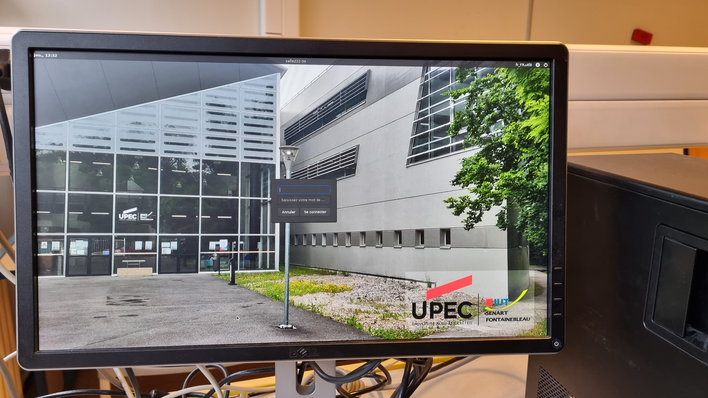
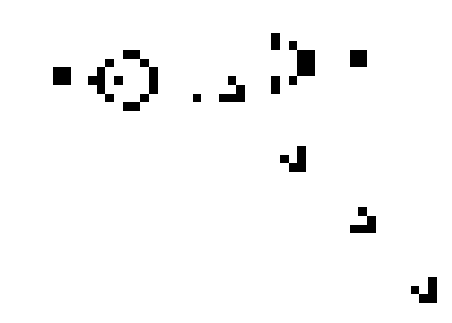
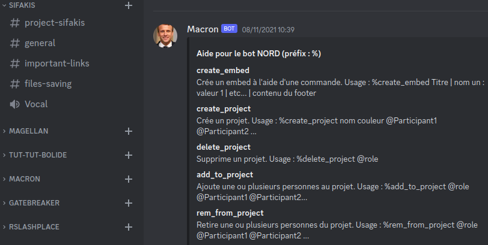
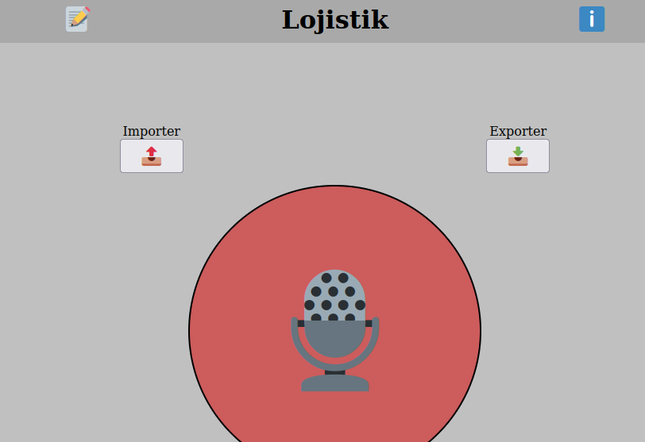

## Présentation

Bonjour,  
Je suis Lucas, passionné d'informatique depuis plus de 13 ans. J'ai commencé par apprendre Python, un des langages les plus utilisés aujourd'hui.
Il s'agit donc du langage que je maitrise le mieux. Lors de mes études, j'ai eu l'occasion d'étudier beaucoup d'autres langages tels que Java, C, Bash, les langages du Web, et bien d'autres. J'ai surtout découvert le développement de jeu vidéo, domaine dans lequel je fais actuellement des études.

---
## Parcours scolaire et professionnel
#### Scolaire
- 2022 / 2025 : *Diplôme d'ingénieur en Informatique et Multimédias à l'ENJMIN (Angoulême) en alternance.*
- 2020 / 2022 : *DUT Informatique à l'IUT de Sénart-Fontainebleau (Fontainebleau).*
- 2017 / 2020 : *Bac S spé SVT option ISN (informatique) au Lycée François Couperin (Fontainebleau).*

#### Professionnel
- 2026 (3 mois) : *Chercheur à l'Université de Salamanque, Espagne.*
- 2022 / 2025 : *Alternant Ingénieur en Lutte Anti-Drone au sein de la DILT.*
- 2022 : *Stagiaire développement web au sein de la DILT.*

---
## Compétences (/5)
#### Langages et Formats
- 5⭐ : Python, Java, HTML, JavaScript, Bash/Shell, Markdown, JSON
- 4⭐ : C, C++, C#, CSS, PHP, SQL, Matlab
- 3⭐ : XML, Batch, LaTeX, Arduino

#### Logiciels, Outils et Plateformes
- 5⭐ : Git, GitHub, VSCode, Linux, Windows, Unity, Excel
- 4⭐ : Sublime Text, Arduino, Suites Microsoft et Libre Office, Edition d'images, IntelliJ

---
## Réalisations

| Description | Illustration |
| :--- | ---: |
| **[🔒](#réalisations "Closed Source") CarteD** Interface web en JS utilisant Leaflet et OSM pour afficher l'emplacement de drones en temps réel, et de visionner les vols passés. Cette interface, accompagnée d'une API fermée, a été développé au sein de la Préfecture de Police de Paris, et il m'est donc impossible de détailler son contenu. Mon application est actuellement utilisée par les forces de l'ordre.|  |
| | |
| **[🔒](#réalisations "Closed Source") Penguin Plugin** Un plugin avancé pour l'outil open source de botting par mémoire [DarkBot](https://darkbot.eu) développé en Java. DarkBot est une application permettant de remplacer le joueur sur le jeu DarkOrbit. Il est open-source et permet d'ajouter des plugins de sources vérifiées (fichiers.jar signés). Le plugin [Penguin](https://discord.gg/bbKub5EWhf), développé en collaboration, propose des fonctionnalités innovantes et plus poussées que la plupart des autres plugins.  |  |
| | |
| **[🔓](#réalisations "Open Source") Fist & Fury** Un jeu en réalité virtuelle développé avec Unreal Engine 5 dans le cadre d'un cours de réalité virtuelle. Il s'agit d'un jeu de type "Beat Them All" avec pour ennemis les élèves de la 8ème promotion d'IEM. Le jeu prend aussi place dans une reproduction approximative du batiment de formation. On y retrouve plusieurs armes et ennemis avec des caractéristiques différentes. [En savoir plus...](https://github.com/souryma/FistAndFury-P8-Edition) |  |
| | |
| **[🔓](#réalisations "Open Source") Py4200A** Une librairie open-source visant à rendre accessible le testeur de composant Keithley 4200A-SCS via une connexion GPIB ou réseau. Cette librairie orientée objet permet aux chercheurs, créateurs et testeurs de composants d'intéragir avec la machine et de créer des tests intuitivement. Il est également possible d'intéragir à distance avec le matériel grâce à la connexion réseau et en établissant un VPN. Cette librairie ouvre la possibilité de création de logiciels plus facilement, afin de se libérer de Clarius, l'application constructeur.[En savoir plus...](https://github.com/Cava3/Py4200A) |  |
| | |
| **[🔓](#réalisations "Open Source") Blind Maze** Un jeu de labyrinthe classique, avec des graphismes simples mais avec une particularité : il fait trop sombre pour voir. Pour se repérer, le joueur ne peut se fier qu'au son. Il est donc recommandé de dessiner une carte sur une feuille. Attention aux gobelins ! [En savoir plus...](https://github.com/IeM-P8/Blind-Maze) |  |
| | |
| **[🔒](#réalisations "Closed Source") Skit Story** Un jeu narratif ayant pour objectif de lutter contre le tabagisme au collège, réalisé pour l'organisation [SKIT Défi Santé Jeunesse](https://skit.fr). Il s'agit d'une application Android, également déployable pour IOS. Le contenu est créé à l'aide de l'outil web de rédaction Twine, et le passage en application est fait grace à Capacitor by Ionic.  |  |
| | |
| **[🔒](#réalisations "Closed Source") GateBreaker (braco)** GateBreaker (aussi surnommé braco) est un projet de vol des identifiants et mot de passe des autres élèves de mon IUT par du phishing. Nous avons reproduis en Java/swing l'interface de connexion aux ordinateur de notre école pour que les étudiants entrent leurs identifiants. Le programme était lancé sur un compte anonyme, et ferme la session dès que les données sont entrées. Les données sont stockées sur le compte d'un étudiant préalablement piraté. |  |
| | |
| **[🔒](#réalisations "Closed Source") Loup-Garou Discord** Il s'agit d'un bot Discord écrit en Python qui implémente le jeu du Loup-Garou. Sont implémentés 10 rôles en plus du villageois de base. Les Loups-Garous ont un canal de discussion isolé pour pouvoir discuter lors du vote. (Ce bot utilise une librairie discord Python désormais dépréciée)  |  |
| | |
| **[🔓](#réalisations "Open Source") Game of Life** Implémentation du jeu de la vie de Conway en Python avec quelques ajouts utiles tels qu'un système de templates (fichiers), de pause, de ralentissement et acceleration du temps, etc. Il y a cependant des limitations côté optimisation et taille du terrain. L'architecture actuelle du programme soit être revue entièrement afin d'acceuillir un système de terrain infini. [En savoir plus...](https://github.com/Cava3/tp-python-game-of-life) |  |
| | |
| **[🔒](#réalisations "Closed Source") Shower Button** Un petit dispositif basé sur un ESP32 équipé d'un bouton permettant d'envoyer un message simple sur un salon Discord. Le code a été produit sur l'Arduino IDE, avec des librairies très utilisées et légères (WiFi et HTTPS). La requête d'envoi de message se fait directement à l'API, sans passer par une librairie dédiée à Discord. L'intérêt est de pouvoir lier un compte utilisateur classique au bouton.  |  |
| | |
| **[🔓](#réalisations "Open Source") Bot Macron** Ce bot Discord permet une gestion simple et rapide de création de salons dédiés à des projets ou sujets. Le bot est dédié au serveur "Parce que c'est notre projet !", afin de permettre la création de projets de groupe ou non en quelques clics seulement. Il contient aussi quelques fonctions plus généralistes, permettant de ne pas ajouter d'autres bots au serveur, réduisant ainsi les risques d'arnaque au bot. [En savoir plus...](https://github.com/Cava3/Macron) |  |
| | |
| **[🔓](#réalisations "Open Source") Lojistik** Lojistik est un mini projets servant de proof of concept pour une fonctionnalité intéressante présente sur tous les navigateurs à jour. Il lie la reconnaissance vocale et la gestion du presse-papier afin de permettre de pouvoir passer rapidement d'un élément à un autre. Malheureusement, les sécurités mises en place par les navigateurs sur ces deux nouvelles technologies ne permettent pas un fonctionnement de l'application en arrière plan... [En savoir plus...](https://github.com/Cava3/Lojistik) |  |
| | |

---
## Contact
Par ordre de rapidité de réponse :
 - 📞 [06 52 14 43 42](tel:+33652144342)
 - Discord : @roucoops
 - 📨 [lucastag77@gmail.com](mailto:lucastag77@gmail.com)
 - [LinkedIn](https://www.linkedin.com/in/lucas-le-dudal/)
